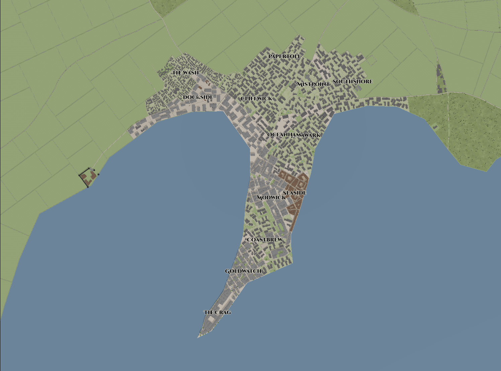

# City: Crag

## Summary
| | |
|----------------:|:--------------------|
| Map of Crag     | |
| Region          | Grey Sea            |
| Nation          | Independent         |
| Main Culture    | Wuldan              |
| Minor Cultures  | Taynnish, Kaldrinic |
| Population      | 1,000 - 0 K.E.      |
|                 | 5,000 - 100 K.E.    |
|                 | 10,000 - 450 K.E.   |
|                 | 12,000 - 600 K.E.   |
| Ruler           | Merchant Council    |
| Main Industries | Mercantile Trade,   |
|                 | Seafood, Oil, Wool  |

## Early History of Crag  

Crag was founded many centuries before the arrival of the Kaldrinic Empire by wayward sailors, fisherpeople, and as a lay over for merchants and pirates plying the Grey Sea. It was not until the establishment of the Empire and expansion of Imperial control over maritime trade, at which time Crag expanded as a place where trade could occur free from Imperial control and taxation.

In Crag's earliest days, there was minimal leadership and instead it was an egalitarian free-for-all, free from the autocratic structures of the mainland nations. By around 150 K.E. the city had grown to the size of needing more direct leadership. The Council of Merchants was formed by the wealthiest residents of the city, most of whom had grown wealthy through both legal and illicit trade. Each member of the council is allowed to sit on the council for 10 years before they must step down. Vacancies are filled by a public process in which aspiring members must collect as many votes as possible. This typically leads to widespread bribery, promises made, and threats, a process that is widely accepted throughout the City as the cost of leading Crag.

## Notable Residents

Thorvir the Raven

Denryla

Lord Tyrson Corrack

Lady Louissa Corrack

Lord-heir Eywin Corrack

