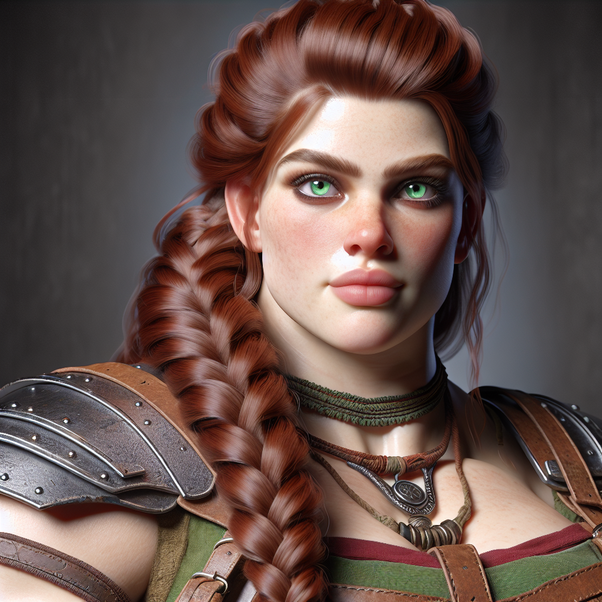
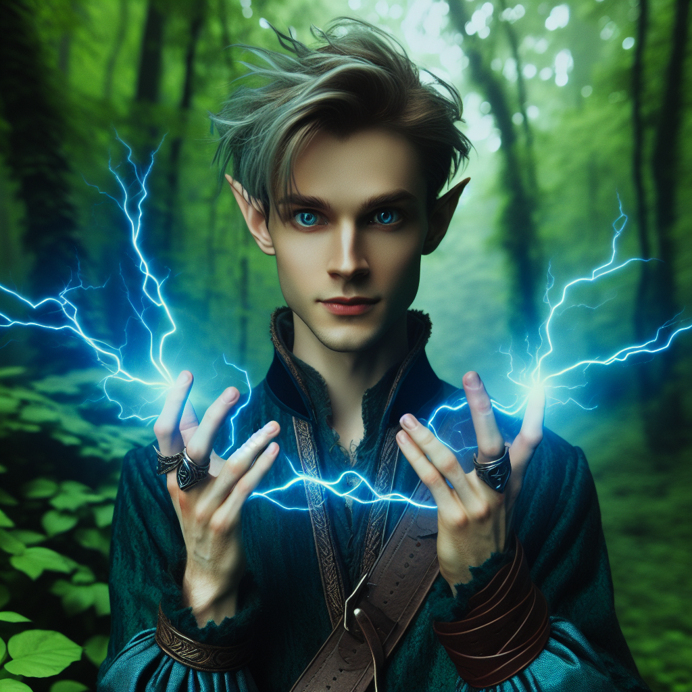
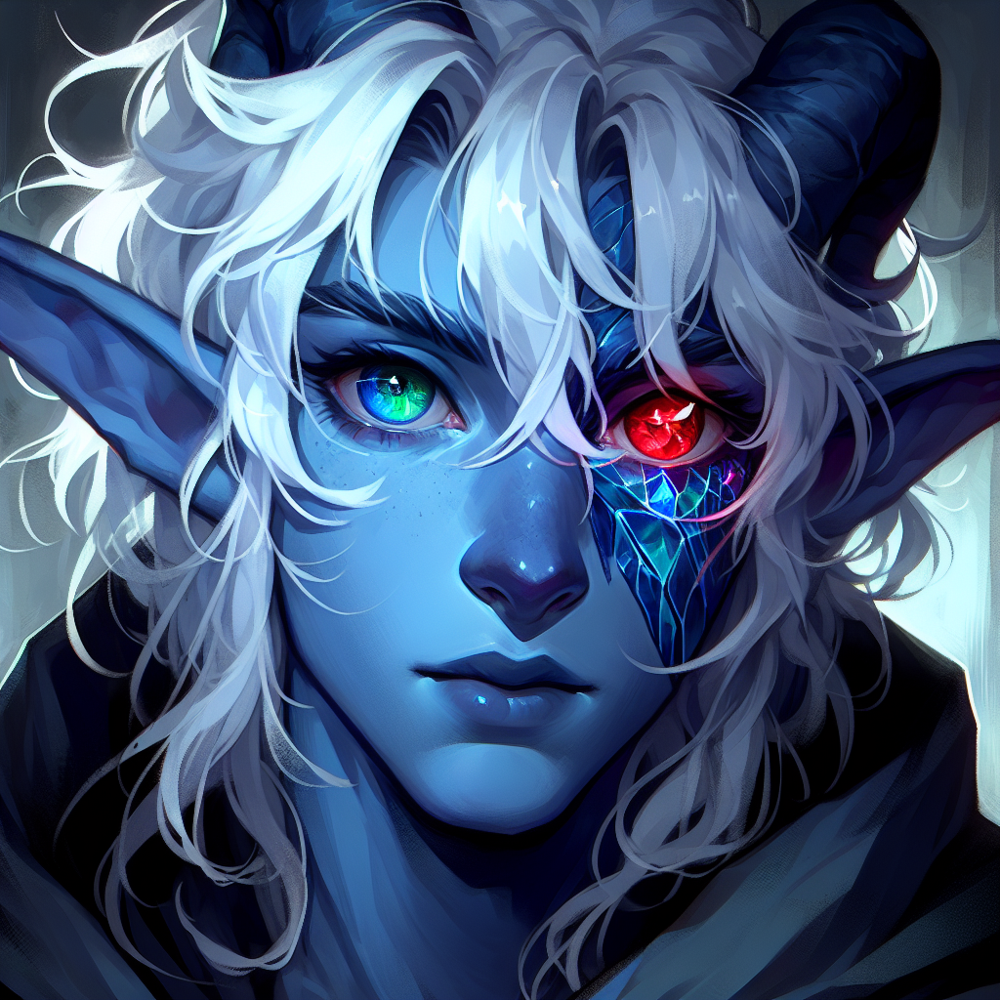

# Characters

<!-- HTML goes here -->

<!-- end HTML -->

**Dungeon Master:** Adam

## Player Characters
### Boudicca

| | |
|-------------:|:--------------------|
| Picture      |  |
| Race         | Dwarf               |
| Class        | Fighter             |
| Subclass     | Eldritch Knight     |
| Alignment    | Unknown             |
| Controller   | Charlotte           |

### Flim-Flam

| | |
|-------------:|:--------------------|
| Picture      |  |
| Race         | Wood Elf             |
| Class        | Mage                 |
| Subclass     | School of Evocation  |
| Alignment    | Unknown              |
| Controller   | August               |

### Hazar

| | |
|-------------:|:--------------------|
| Picture      |  |
| Race         | Human                |
| Class        | Rogue                |
| Subclass     | Assassin             |
| Alignment    | Unknown              |
| Controller   | Mike                 |

### Lightsong the Haunted

| | |
|-------------:|:--------------------|
| Picture      |  |
| Race         | Dreamcursed (Tiefling of Fierna)  |
| Class        | Bard                |
| Subclass     | College of Whispers |
| Alignment    | Chaotic Good        |
| Controller   | Jon                 |

### Torin Thunderridge

| | |
|-------------:|:--------------------|
| Picture      |  |
| Race         | Dwarf               |
| Class        | Barbarian           |
| Subclass     | Totem Warrior       |
| Alignment    | Unknown             |
| Controller   | Matt                |

## Non-Player Characters (NPCs)

### Friendly
- That Bartender (Day 1)
- That Half-orc Bouncer (Day 1)
- Delira, The Wizard Lady in the Tower (Day 3)
- Thorvir (Day 2)
- Thorvir's gnome attendant (Day 2)
- Lighthammer the Smith (Day 3)

### Hostile
- Lordling - Ewyin Korak (Day 1) (Incapacitated as of Day 3)
- Lordling's goons (Day 1)
- Warehouse manager (Day 2) (Deceased)
- Warehouse lackeys (Day 2) (Deceased)
- Loric Swin, Guard Captain of the Korak Estate (Deceased)
- Lord Tiersen Korak (Day 3) (Incapacitated as of Day 3)
- Lady Louissa Korak (Day 3) (Incapacitated as of Day 3)
