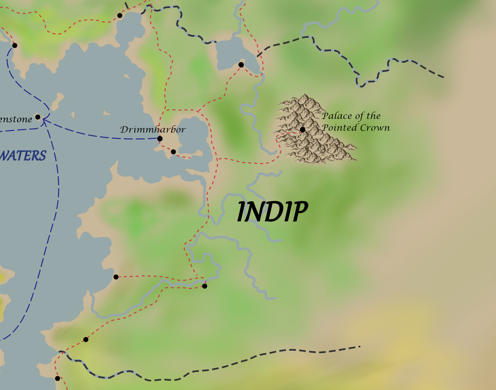
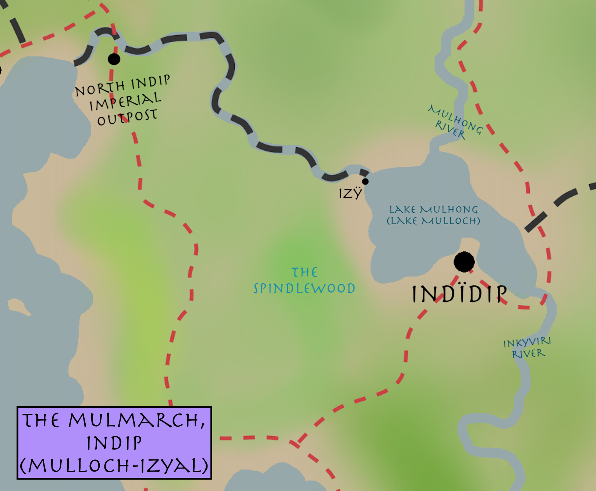
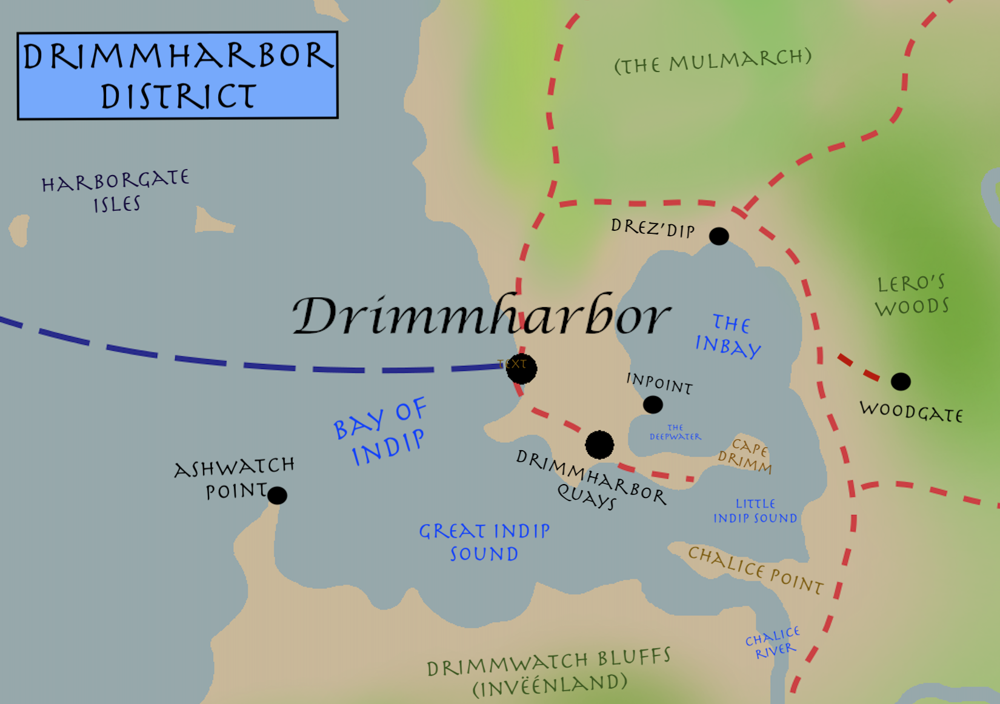
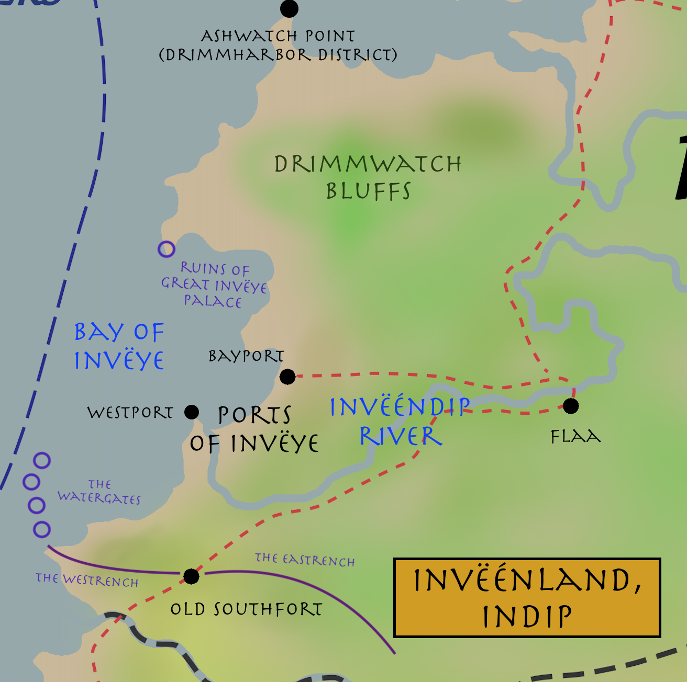
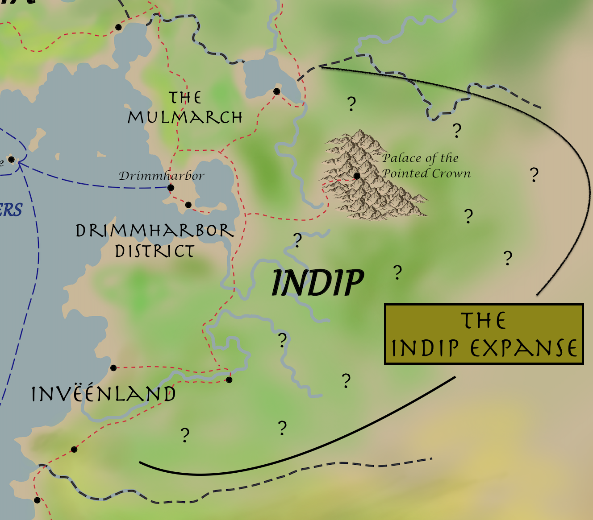

# Region: Indip

## Quick facts
{{#include ./stubs/indip_background_stub.md}}

## Summary
Indip is one of the oldest Imperial provinces, containing most of the former Old Indipian Empire (_Ley-Indip-Ley_). Interestingly, Indip as a whole is now often thought of as a backwater, despite its more central location geographically and Old Indip's tremendous wealth and military might. The current capital of Provincial Indip, __Drimmharbor__, is home to the Imperial Navy Fleet.

Being less than a day's boat ride from Ashenstone, __Drimmharbor__ is as cosmopolitan as __Ashenstone__ itself. The size and wealth of Drimmharbor lead many to forget that the greater __Drimmharbor District__  is not itself a top-level province of the Empire, and most Ashenstonians never mention "Indip" by name, instead referring to the region as a whole as Drimmharbor or Drimmland.

## Districts of Indip

### Overview  
Ashenstone's Imperial Land Ministry divides Indip into three coastal "districts", and the unorganized "Indip Expanse":

1. __The Mulmarch__. Agricultural region north of Drimmharbor, extending up to the border of Mulhong. The original homeland of the Human nomads who eventually coalesced and formed the Old Indip Empire. _Indïdip_ ("Over-Indip"), the historic capital of the Old Indipian Empire is located here, on the south shore of Lake Mulloch. Briefly the population center of the region after the formation of the Old Indip Empire, this area depopulated quickly after the establishment of Drimmharbor. Now economically depressed, though home to some interesting architecture and a cultural center of traditional Indipian crafts. Considered a pass-through region by most Imperials.

2. __Drimmharbor District__. Officially the modern capital district of Indip, though many forget it is not an Imperial province in itself. Home to roughly 80% of the total population of Indip, and virtually all of the Human population.

3. __Ivëénland__. Historically called _Invëye_ and home to the largest city of the classical pre-Kaldrinic world, _Great Invëye_ (Faï-Invëye). Mostly comprised of productive farmlands and wetlands on the southern Indipian coast. Historically important to the Old Indip Empire as a buttress against the Orcs of the Rock Hills, it is now mostly rural in character, though far more accesible than the Indip Expanse. While _Great Invëye_ as a whole is no more, active port-towns and fishing villages provide modest but decent living standards to their residents who live alongside the vast archaeological sites and ruins dotting the Bay of Invëye.

4. __The Indip Expanse__. The vast interior of Isndip, "expanding" to the Gold Desert. Civilian law does not apply here, mostly because there's no one to enforce it. Historically, both Old Indip and Ashenstone's touch here has been very light.

Within the borders of the Indip and the Indip Expanse is __The Palace of the Pointed Crown__, a semi-sovereign religious enclave surrounded by Indipian lands. It is included here for convenience, but it is not adminstratively considered part of Indip by the Land Ministry.

### 1. The Mulmarch (Mulloch-Izyal)

This region, originally known as Mulloch-Izyal, is the birthplace of the Old Indipian Empire and the ancestral home of the Chieftans and Fu-Leys of Mulloch-Izyal. Home to the Capital of Old Indip, Indïdip, known as Mullochi-Izyali before the founding of the Ley-Indip-Ley.

While wealthy with lush farmland and forests in the early days of the Ley-Indip-Ley, imperial attention soon turned to the Southern Region of Invëye. By -200 KD, land mismanagement and military defeat led to the gradual depopulation of the region and the collapse of the North Indipian Empire.

Currently economically depressed, denuded, and very sparesely populated outside of Indïdip and the small town of Izÿ, on the border of Mulhong. The North Indip Imperial Outpost exists to collect customs and offer some amenities to travellers on their way to and from Drimmharbor.

#### Industries
Some small salt mines exist around lake Mulhong, near Indïdip and Izÿ. Decent firewood and small crafts timber production from the Spindlewood provide some economic activity through exports to Mulhong and Drimmharbor. A modest but growing tourism industry focusing on the history of Old Indip comprises the bulk of Indïdip's economy.

### 2. Drimmharbor District

By far the most populous and economically important of modern Indip's sub-regions. The Drimmharbor District is also the site of the most ancient settlements in Indip, though its population remained small until the founding of Drimmharbor after Old Indip's takeover by Ashenstone. The Inbay, a small internal sea, contains The Deepwater, namesake of Indip. While very small in area, it contains some of the deepst waters in the Empire, and fishing rights are leased exclusively to restaurants and hobby fishers in the fabulously wealthy and exclusive town of Inpoint.

- __Drimmharbor__ - capital, site of the Royal Navy Yards, the Royal Navy Academy, the Imperial Land Ministry's Eastern Headquarters, and home to the headquarters of the famously flamboyant _Lighthousers Guild_, one of the rare organizations politically savvy enough to have a strong presence in both Imperial and non-Imperial provinces. 

    The largest city by land area and fourth largest city by population in the Kaldrinic Empire, after Ashenstone, Balnoorial, and Taynuilt City. Extremely cosmopolitan, with Humans, Elves, Half-elves, Half-orcs, and even some Dwarves and Gnomes taking residence. 
    
    Drimmharbor's City Government is complex, splitting power between a Civilian Legislature, a Maritime Merchant Council, and the High Command of the Imperial Navy. The three entities meet together on the first of every month in the politically and ceremonially important Drimm Conference, which enacts laws that apply to the entire District. The Imperial Navy High Command generally allows the highly active Maritime Merchant Council and Civilian Legislature to negotiate affairs for the city during these conferences, but occasionally wields its powers of Absolute Veto and Naval Decree, especially in times of war or civil unrest. Additionally, The Imperial Navy High Command, which reports directly to the Emperor in Ashenstone, alone has the power to cancel or reschedule a Drimm Conference.

- __Drimmharbor Quays__ - Navy operated satellite city of Drimmharbor. Site of the vast imperial drydocks and manufactories. The city is curiously under strict martial law since 390 KD. Rigorous systems of checkpoints prevent unauthorized entry despite its massive size. Notably absent of half-orcs, though the Empire claims it does not engage in discrimination. In recent years, vast shipments of enormous logs have been reported by whistleblowers, though officials either deny the rumors or refuse to comment on the matter.  

- __Drez'dip__ - "Across Deepwater" - Half-orcs were historically pushed out of the areas immediately surrounding Drimmharbor, their claimed holy promised land, and as such the largest Half-orc town remaining in Indip is __Drez'dip__, on the shallower water Northern coast of the Inbay. Expanded fishing rights granted in reforms of recent decades have slightly improved the fortunes of the population, but there is still much poverty and resentment, especially since these fishing rights do not apply to the historical deepwaters where the best fish may be caught, in the Deepwater.  

- __Inpoint__ - a very wealthy and opulent town dominated by Naval Academy elites, on the cliffs overlooking the clear deep waters of the Deepwater.  

- __Cape Drimm__ - a small but popular destination for relaxation and hobby fishing. Fresh seafood is caught daily by seasonally licensed human and travelling half-orc fishermen. Despite existing road and land access, many now visit by boats embarking from Northeast Drimmharbor to avoid the activity and checkpoints around the Drimmharbor Quays. Private sea-side roads lead directly here from __Inpoint__.  

- __Ashwatch Point__ - a small but elegant town across the Great Indip Sound from Drimmharbor. Site of the Ashwatch Lighthouse, pride of the Lighthouser's Guild. The Ashwatch Lighthouse notably houses a world-class observatory from which the Lighthousers boast they can as easily view the stars as they can the private lives of Ashenstone City's nobles through the windows in their towers across the Jewel Waters.

- __Woodgate__ - a small town on the edge of the District in the modest but economically and culturally important Lero's Woods. Founded in 31 KD by Admiral Hiro Drimm's son, Lero Drimm, as a lumbering outpost. Now offers tourism services and its market supplies goods to hunters and foragers. The Lero Drimm Lumbering Museum is headquartered here.

### 3. Invëénland

__Invëénland__, historically called Invëye, was a critical region to Old Indip until its fall in 7 KD, despite its relative obscurity today. The oldest permanent settlements here are attributed to the Humans of Old Indip. Centered around the Bay of Invëye, Invëénland was both the economic and military center of the Middle Indipian Empire, and its regional capital, __Great Invëye__ so far outpaced the size, population, military presence, and economic output of the old capital of __Indïdip__ that it was often considered the capital despite not being declared as such until the splitting of Old Indip into North and South Indipian Empires. Despite having largely decayed by the time of the Kaldrinic Empire's rise, it is said that Ashenstone set its sites on Indip so early on during its conquests lest some other power claim the right to the glory of Old South Indip and its jewel, __Great Invëye__.

As previously mentioned, __Great Invëye__ is no more, but its two historical ports of __Bayport__ and __Westport__, now themselves humble but active port-towns, offer glimpses of __Great Invëye__'s former splendor.

It's hard to overstate the threat that Old Indip felt from the Orcs of the Rock Hills. If Half-orcs were holy to the humans of Old Indip, Orcs were the very opposite, considered accursed. To be fair to the Old Indipians, The Orcs of the Rock Hills waged centuries of apparently unprovoked war against both the semi-nomadic Half-orcs and the Humans who considered them their sacred ward. To this effect, Old Indip constructed one of the great wonders of the pre-Kaldrinic world: __The Watergates__, four leviathan floating fortresses imbued with long forgotten magics. Combined with the large __Southfort__ and the __Great Trenches__ (Eastrench and Westrench), the very geography of South Invëénland was fortified against threats from the Rock Hills and beyond, whether by land or by sea.

When the Ley-Indip-Ley split into independent North and South portions, Invëye remained an important though diminished city until the darkening of The Watergates in -326 KD. Its slow collapse was complete when the last South Indipian Emperor, Trag Antal II, was defeated and beheaded by Kaldrinic forces during the razing of Great Invëye Palace in 7 KD. The city was burned and much of the population relocatd to Drimmharbor.

__Flaa__, in the east of Invëénland, is a predominantly Elvish forest-town meaning "Friends" in an Elvish/Half-orcish sylvan pidgin. Home mostly to Cosmpolitan Elves (those Elves who generally live along Humans and Half-elves in the cities of the Empire) and a small number of Half-orcs, it has remained relatively stable despite centuries of shifting Indipian and Kaldrinic power structures. Some say it has long been protected by powerful magics, though the Elves demur on this subject. 

While fairly remote, Flaa does sit both on the __Invëéndip River__ _and_ on the lightly used land-route between the Ports of Invëye and Drimmharbor. Accordingly, it sees a small but regular cadence of travellers.

Flaa is known for its natural beauty, hospitality, woodland setting, and hot springs. Salmon and Trout are plentiful inm the river, and each spring Flaa hosts "The Feast of Friends," feeding guests and residents at no cost and exporting excess catch downriver to Westport for sale.

The Empire collects taxes in Flaa and includes it in the Invëénland census, but otherwise leaves the Elves to manage the city autonomously. Half-orcs are included on the town council, and are treated much better here than in the Drimmharbor District, leading to a small population influx in the last century.

### The Indip Expanse

Even today, most citizens of the Ashenstone Empire know little about the vast interior of Indip, despite its long inclusion under Imperial Dominion. The boundaries of the Expanse are not strictly definied, but it's safe to say that virtually all lands east of Lake Mulhong running south to the Rock Hills (and even as far West as __Flaa__ and the terminus of the __Eastrench__) can be included in its general area. It is said by the Elves that Forests of immense stature and unknowable age once stood in gorges carved by the headwaters of the Invëéndip and Chalice Rivers. From the __Palace of the Pointed Crown__, technically within the Indip Expanse, no such forests are visible from the expansive southern vistas, but rumors persist that some remnants may still be found.

The Indip Expanse is very rarely visited by humans, unless the __Palace of the Pointed Crown__ is included. The Empire maintains a policy of non-settlement, though in practice this only legally applies to Humans. Elves, Half-elves, and Half-orcs are said to make up the majority of the population, but no official records are kept.

### The Palace of the Pointed Crown

__WIP__

## History

Indip is one of the oldest Imperial Provinces, having been among the first of the "Old Kingdoms" to fall to the Kaldrinic Dynasty in year 7 K.D. (Ekrypt was first, in year 4 K.D. Before the arrival of the Kaldrinic Empire, Indip was a separate empire that spanned modern Indip, large portions of the Rock Hills, and southeastern portions of modern Mulhong. However, the empire's hey-day was long past and thus made an easy target for the newer, stronger Kaldrinic Empire.  

Drimmharbor was founded by Admiral Hiro Drimm in 6 K.D. as a major shipyard for the Kaldrinic Empire. Following the fall of the Indipian Empire it was designated the Provincial Capital of the new Kaldrinic holdings on the east side of the Jewel Sea (provinces would not be organized until 36 K.D.). It still is the home of the main Imperial Shipyard and a major trade hub. The Palace of the Pointed Crown is built deep into the mountains (unnamed) in the east part of Indip. This is the headquarters of the Church of the Pointed Crown (think the Vatican), built atop the ruins of an older Indipian temple monastery. It functions more like a small city.  

The region now known to the Kaldrinic Empire as "Indip" was previously part of the Old Indipian Empire and long a refuge to the Unhorned "Half Orcs" fleeing persecuting at the hands of their cousins, the Orcs. It is said the lands were also important to the Elves, but most cosmopolitan elvish communities report not knowing much about Indip. The Old Indipian Empire, _Ley-Indip-Ley_ was founded in -903 KD by Trag Çom Anatala I, daughter of the Fu-Ley of Mulloch-Izyali, combining

The Old Indipian _Ley-Indip-Ley_ means "Great Land of Indip", or literally "Land of Indip Land."  _Ley-Indip-Ley_ is itself an adoption of the much older Unhorned/half-orc name _Lz Ïndip'ey Ah_, or "Beside Deepwater [that is] Ours, Clear". Thus, the word _Ïndip_ means literally "Deepwater," likely referring to the small crater-sea now called the __Inbay__, the deepest known waters in the Empire. It is theorized that the Deepwater was formed when a small splinter of Almak collided with the lands on the east coast of the Jewel Waters before -4000 KD. 

_Yå'lv_, for the curious, is the word for shallow water ("waist-wet"), the old Half-Orc language having no word simply "water," using instead the word _Gerz'lv_ meaing "life-wet" for water that is imbibed. This name _Lz Ïndip'ey Ah_ refers to the alleged home harbor of the Half-orcs, which Half-orc elders insist is now the site of the Drimmharbor Quays - a great travesty to their culture.

Half-orcs were venerated members of the _Ley-Indip-Ley_, who adapted the name of the Half-orc settlement in deep respect bordering on religious fervor, much to the confusion and eventual amusement of the Half-orcs. After the fall of the old Indipian Empire to the Kaldrinic Empire, the rights of half-orcs diminished steadily. Over four centuries of Kaldrinic dominion, humans have replaced much of the naturalized and native Half-Orc population, at least on the coast, though sizeable "uncontacted" half-orc populations are said to exist in the poorly surveyed interior, themselves said to be either remnants of the original Unhorned refugees from the Inquisition of the Horns to the South, or rewilded bands of Half-orc refugees fleeing Imperial persecution.

Elves, while historically a transient presence in the lands now known as Indip, are increasingly plentiful, both on the coast and in the interior, and seem not to have suffered much under the Empire. In recent decades, rumors of large-scale logging for the Empire's navy (the Empire is famously secretive as to where it sources raw materials), have soured the Elves, Half-elves, and Half-orcs even in places like Drimmharbor and Drez-dip, far from the alleged extractions. Complicating this outrage is the claim by Imperial Foresters that no great forestlands exist in Indip - the Forests directly East, North, and South of the Drimmharbor district are relatively small in area and well visited by hunters, recreators, and foragers, all whom report no notable disturbances.

In present times, the quality of life for Humans (and for many Elves and Half-elves) in the Drimmharbor area ranks among the highest in the Empire, especially among the well-educated elite affiliated with the Drimmharbor Naval Academy and Imperial Navy. Thus, despite a burgeoning movement of resentful nature-lovers and tree-worshippers, public support for the Empire is arguably higher in the cosmpolitan population of Indip than even in Ashenstone itself. It is said that to find Ashenstone's most loyal subjects, look to Drimmharbor rather than Ashestone.