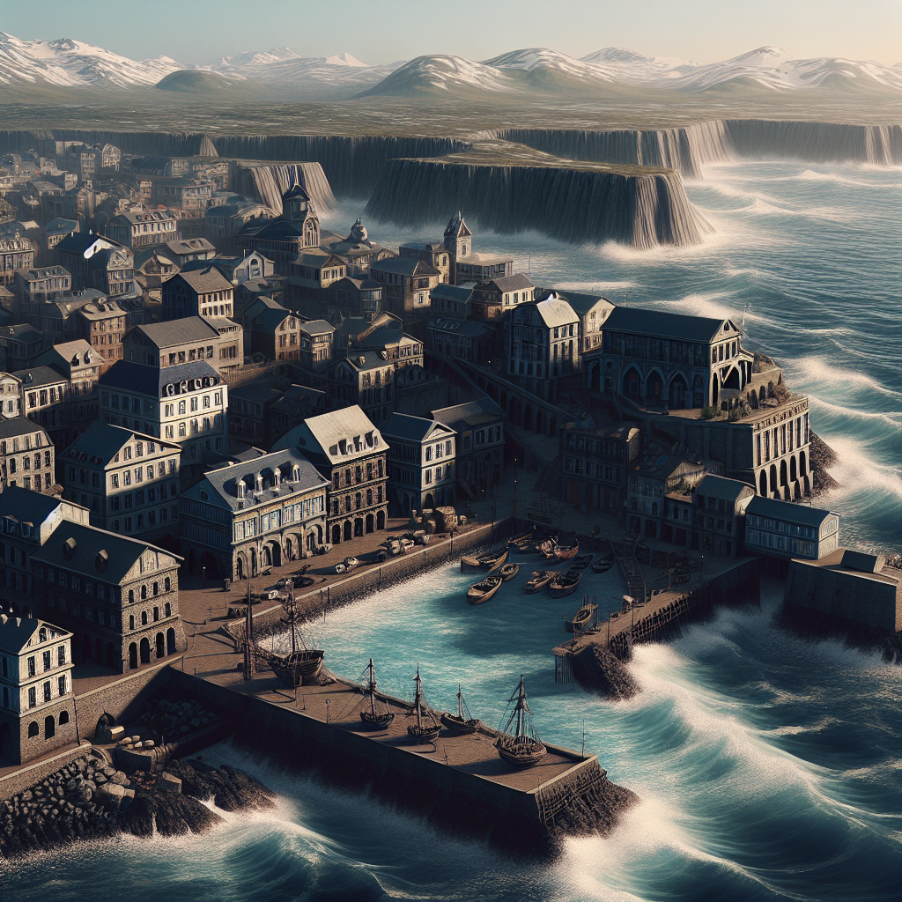

# City: Laigfhuar

<!-- HTML goes here -->

<!-- end HTML -->

 
<i> A view of Seaside, the harbor and associated neighborhood on Crag's east flank </i>
 
 

{{#include ./stubs/laigfhuar_background.stub.md}}

## Map

 

## Early History of Crag  

Laigfhuar

## Notable Residents

