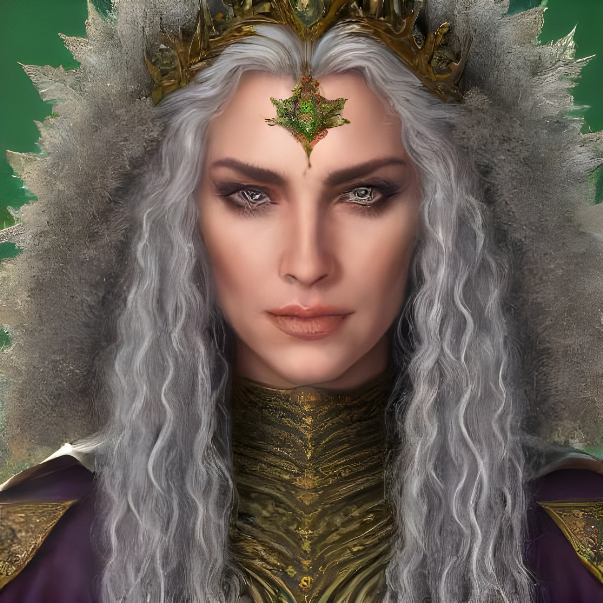

# Lady Louissa Corrack

## General Description
| | |
|-------------:|:--------------------|
| Picture      |  |
| Race         | Human (Taynn)                        |
| Profession   | Nobility, Mage                       |
| Home         | Balnoorial, Later Crag               |
| Born         | 390 K.E.                             |
| Death        | N/A                                  |
| Family       | King Helmin (Husband)                |
|              | Prince Renni (Son)                   |
|              | Louissa (Sister)                     |
| Titles       | Queen of Lynnla (ex)                 |

## Early Life

Queen Shaheila (ne-Garena) was born to Duke Ryck Garena and Duchess Wylna Garena, high-ranking nobility in Lynnla prior to the dissolution of the Lynn Monarchy.

## Career
