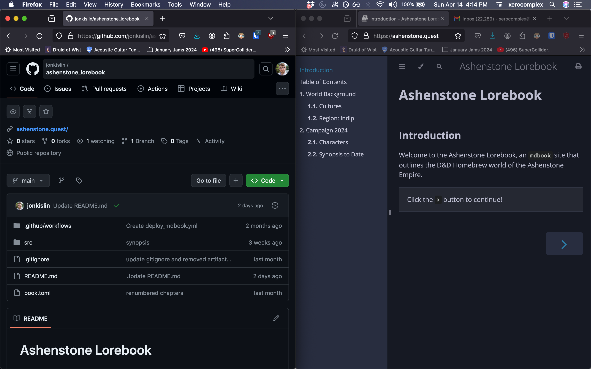
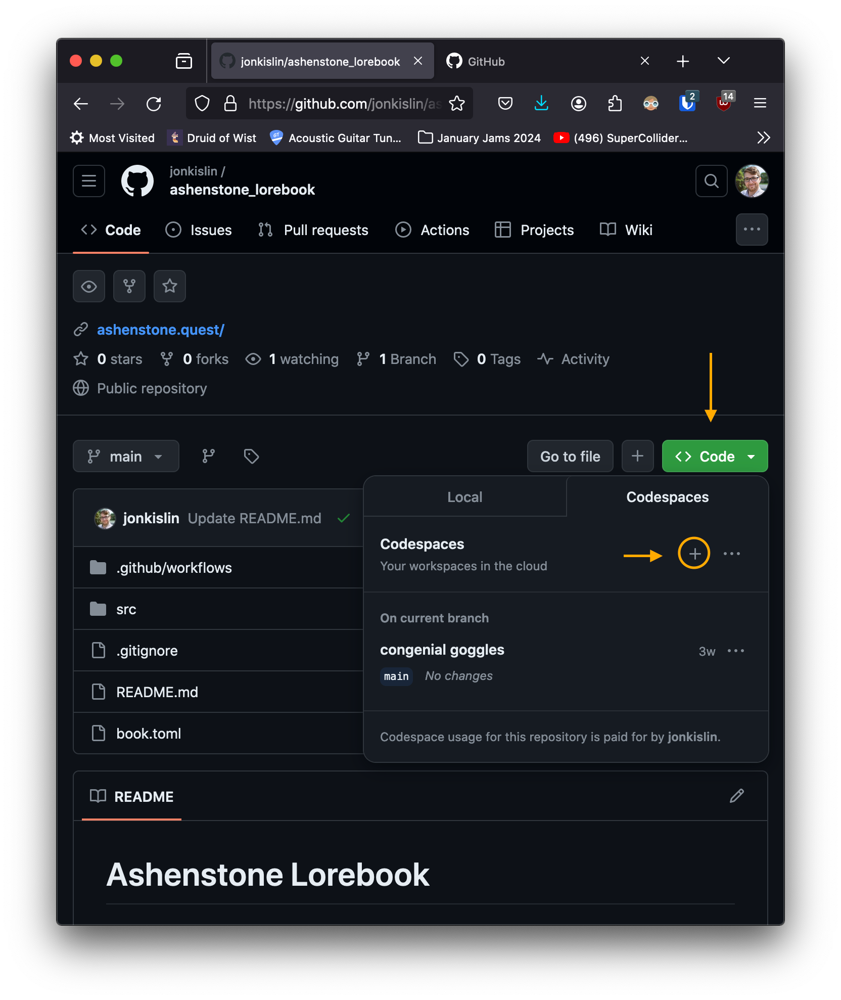
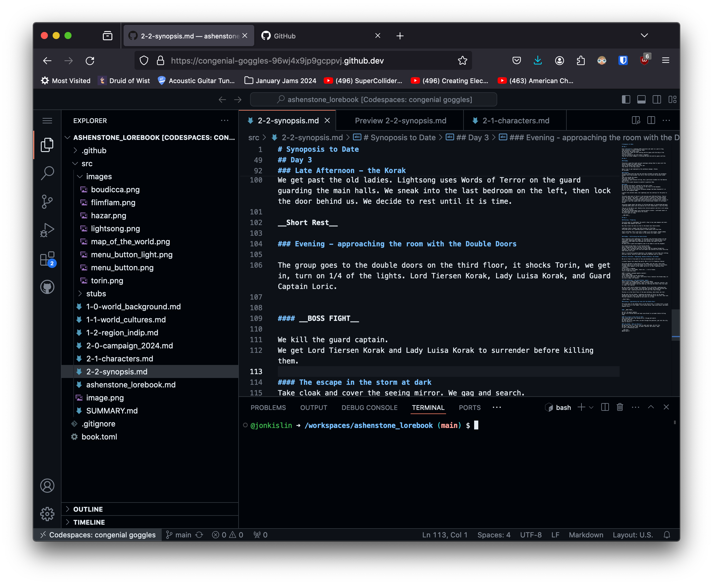

# Contribution Instructions 

This lorebook is not difficult to update, even if you don't have a coding background, but it's also a good beginner foray into the world of coding, if not coding proper.

Here are some quick instructions to get you started, but definitely reach out if you want help. 

## Setting up your Contribution Environment
1. To contribute, you'll need a free github account and an invite to collaborate.

2. The live site is at https://www.ashenstone.quest. The source code and hosting for the site is (currently) at https://github.com/jonkislin/ashenstone_lorebook. To keep myself organized, when I get started editing this thing, I open two browser windows side by side (or as tabs if you prefer):  
    
    

    This will let us manage the code on the left hand side while being able to check that we did things right on the right!

3. These days, my preferred way of editing the site is to use a Github-hosted "codespace". This is a new feature that handles a lot of the annoying git and local repo setup steps that people unfamiliar with git can find challenging. Once you're into the repo, you can click on the green code button and select "Codespace":

    

    (If we overuse the Codespaces feature, It will try to start charging me money, but we get a lot of free time before we get there. I'm not too worried about it). 

4. Once you actually get into your codespace, if you're familiar with Microsoft's VS Code software, you'll see a familiar site as codespaces are basically just VS Code servers that live on Github, rather than on your computer. This is convenient, again, because it gets you ready to start editing the site without having to setup git on your machine or figure out how to connect it to github while opening up a properly cloned repository. (I can show you all of these things, later).

    

    You can see here a few key things:
    - On the left, a file navigator. This lets you explore everything we need to make edits and additions to ashenstone.quest, including text content files, pictures, theming files, and configuration files.
    - The main editor pane, which is just plain text, like what you'd get in a text message or on an app like Notepad, unlike something like Microsoft Word which has formatting options. Note the tabs at the top that let you keep multiple code files open at the same time. You can open and close them at will.
    - A terminal, underneath the main editor pane. We can ignore this entirely, but it's powerful if you learn to use it.

If you've gotten this far, great! Even though by this point in the instructions you wouldn't have edited anything yet.

### Challenge for you!

As a challenge, try making updates to any named code file with the extension ".md" in the repository. (You won't break anything I promise, and even if you do, git is meticulously backup.) Like in Microsoft Word, you hit CTRL+S (or CMD+S on Mac) to save the file. You'll notice, however, that merely saving the code does nothing to the live site, though it does make an icon on the left sidebar change. See if you can figure out how to actually push a change to the site. If you do, you're steps ahead :)  

If you'd like further instructions, please reach out to Jon Kislin or Adam Bailey.